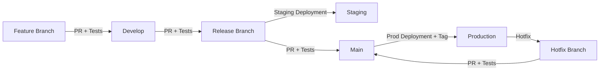

# Flask Boilerplate 🔥

## Description

This boilerplate is a robust starting point for creating production-ready Flask applications. Although tailored for Flask, its core principles are versatile enough for other frameworks and languages. These include maintaining clean architecture, implementing domain-driven design (DDD), and adhering to the SOLID principles for object-oriented design. The project also incorporates the Command Query Responsibility Segregation (CQRS) and Data Transfer Object (DTO) patterns, which enhance data management and system clarity. Embracing test-driven development (TDD), the boilerplate ensures high-quality, reliable code. By applying these best practices, developers can create scalable, maintainable applications that align with modern software engineering standards.

## Badges

### Project Status

[](https://github.com/cedric57/flask-boilerplate/actions/workflows/ci-features.yml)
[](https://github.com/cedric57/flask-boilerplate/actions/workflows/cd-release.yml)
[](https://github.com/cedric57/flask-boilerplate/actions/workflows/cd-main.yml)
[](https://github.com/cedric57/flask-boilerplate/actions/workflows/ci-hotfixes.yml)

[](https://github.com/cedric57/flask-boilerplate/blob/main/LICENSE)
[](https://github.com/pre-commit/pre-commit)

### Used Languages

[](https://www.python.org)
[](https://flask.palletsprojects.com/en/stable/)

### Code Quality

[](https://results.pre-commit.ci/latest/github/cedric57/flask-boilerplate/main)
[](https://github.com/astral-sh/ruff)
[](http://mypy-lang.org/)
[](https://codecov.io/gh/user/repo)
[](https://github.com/cedric57/flask-boilerplate/actions/workflows/links.yml)

### Security


[](https://github.com/PyCQA/bandit)
[](https://snyk.io/)

### Documentation

[](https://flask-boilerplate.readthedocs.io)
[](https://github.com/cedric57/flask-boilerplate/blob/main/README.md)
[](https://github.com/cedric57/flask-boilerplate/blob/main/README.fr.md)
[](https://www.sphinx-doc.org/en/master/)
[](https://www.jetbrains.com/pycharm/)

### Contributions

[](https://github.com/cedric57)


[](CODE_OF_CONDUCT.md)
[](https://github.com/sponsors/cedric57)
[](https://www.buymeacoffee.com/cedric57)
[](https://paypal.me/CedricGRUN)

## ⚡ Features

- Dependency and package management: [Poetry](https://python-poetry.org/)
- Hooks: [Pre-commit](https://github.com/pre-commit/pre-commit-hooks)
- Framework: [Flask](https://flask.palletsprojects.com/en/stable/)
- ORM: [SQLAlchemy](https://www.sqlalchemy.org/)
- Format and Style: [Ruff](https://github.com/astral-sh/ruff) + [MyPy](https://github.com/python/mypy)
- Tests: [Pytest](https://docs.pytest.org/en/stable/)
- Security: [Snyk](https://snyk.io/product/open-source-security-management/) + [Bandit](https://github.com/PyCQA/bandit)
- Documentation: [Sphinx](https://www.sphinx-doc.org/en/master/)

## 👉 Table of Contents

- [Getting Started](#-getting-started)
- [Principles](#-principles)
- [Git Flow Workflow](#-git-flow-workflow)
- [Folder Structure and Code Organization](#-folder-structure-and-code-organization)
- [Useful resources](#useful-resources)
- [Client types generation](#client-types-generation)

## ✨ Getting Started

Set python to UTF8 encoding in Windows shells (cp1252) to avoid conflicts with Git.
In administrator powershell :

```powershell
[Environment]::SetEnvironmentVariable("PYTHONUTF8", "1", "Machine")
```

Configure a Poetry environment : [Documentation JetBrains](https://www.jetbrains.com/help/pycharm/poetry.html)

```powershell
(Invoke-WebRequest -Uri https://install.python-poetry.org -UseBasicParsing).Content | python -

[Environment]::SetEnvironmentVariable("Path", [Environment]::GetEnvironmentVariable("Path", "User") + ";%APPDATA%\Python\Scripts", "User")
```

```bash
git clone https://github.com/cedric57/flask-boilerplate.git my-app
cd my-app

# To enable poetry follow the instruction here: https://python-poetry.org/docs/#installing-with-the-official-installer
poetry install #Install dependencies.
```

### Common Commands

- `poetry install` - Installation with poetry
- `poetry install --extras "web cli"` - Installation with extras
- `poetry install --with dev` - Installation for development
- `poetry install --with docs` - Installation for documentation
- `poetry run ruff .` - Format the code
- `poetry run mypy .` - Check types
- `poetry run pre-commit run --all-files` - Run pre-commit
- `poetry run pytest` - Run tests
- `poetry run flask-boilerplate` - Start application
- `poetry add requests` - Add a dependency
- `poetry add --group dev pytest` - Add a dev dependency
- `poetry remove requests` - Remove a dependency

## 🧱 Principles

## 🛠 Git Flow Workflow

This project follows the **Git Flow** strategy to ensure organized and secure development. The main branches (`main`, `develop`) and release branches (`release/*`) are **protected**: changes must go through **Pull Requests (PRs)** validated by code reviews, automated tests, and security checks. Below is the workflow:



### Key Steps

1. **Development**:

   - `feature/*` branches are created from `develop` and merged via **PR** after passing tests (`pytest`, `pre-commit`).
   - `hotfix/*` branches address critical issues in `main` and require an urgent PR.

1. **Release Preparation**:

   - A `release/*` branch is created from `develop` for final testing and **staging deployment**.
   - After validation, a PR merges the release into `main`.

1. **Production Deployment**:

   - Merging into `main` triggers an automated **production deployment** (Docker) and a semantic tag (`v1.2.3`).
   - Hotfixes deployed to production generate a new tag.

### Automated Tools

- ✅ **GitHub Actions**: Runs tests, security checks (`Bandit`, `Safety`, `Snyk`), and deployments.
- 🔒 **Protected Branches**: Direct pushes to `main`, `develop`, or `release/*` are blocked.
- 📦 **Poetry**: Manages dependencies and environment isolation.

This workflow ensures **continuous integration**, **reliable delivery**, and a **clean project history**. For contributions, follow the guidelines in [CONTRIBUTING.md](./CONTRIBUTING.md).

## 📁 Folder Structure and Code Organization

```text
📁 .
├── ⚙️ .cursorrules \<- LLM instructions for Cursor IDE
├── 💻 .devcontainer \<- Devcontainer config
├── ⚙️ .gitattributes \<- GIT-LFS Setup Configuration
├── 🧑‍💻 .github
│ ├── ⚡️ actions
│ │ └── 📁 setup-python-env \<- Automated python setup w/ uv
│ ├── 💡 ISSUE_TEMPLATE \<- Templates for Raising Issues on GH
│ ├── 💡 pull_request_template.md \<- Template for making GitHub PR
│ └── ⚡️ workflows
│ ├── 🚀 main.yml \<- Automated cross-platform testing w/ uv, precommit, deptry,
│ └── 🚀 on-release-main.yml \<- Automated mkdocs updates
├── 💻 .vscode \<- Preconfigured extensions, debug profiles, workspaces, and tasks for VSCode/Cursor powerusers
│ ├── 🚀 launch.json
│ ├── ⚙️ settings.json
│ ├── 📋 tasks.json
│ └── ⚙️ '{{ cookiecutter.repo_name }}.code-workspace'
├── 📁 data
│ ├── 📁 external \<- Data from third party sources
│ ├── 📁 interim \<- Intermediate data that has been transformed
│ ├── 📁 processed \<- The final, canonical data sets for modeling
│ └── 📁 raw \<- The original, immutable data dump
├── 🐳 docker \<- Docker configuration for reproducability
├── 📚 docs \<- Project documentation (using mkdocs)
├── 👩‍⚖️ LICENSE \<- Open-source license if one is chosen
├── 📋 logs \<- Preconfigured logging directory for
├── 👷‍♂️ Makefile \<- Makefile with convenience commands (PyPi publishing, formatting, testing, and more)
├── 🚀 Taskfile.yml \<- Modern alternative to Makefile w/ same functionality
├── 📁 notebooks \<- Jupyter notebooks
│ ├── 📓 01_name_example.ipynb
│ └── 📰 README.md
├── 🗑️ out
│ ├── 📁 features \<- Extracted Features
│ ├── 📁 models \<- Trained and serialized models
│ └── 📚 reports \<- Generated analysis
│ └── 📊 figures \<- Generated graphics and figures
├── 🔒 secrets \<- Ignored project-level secrets directory to keep API keys and SSH keys safe and separate from your system (no setting up a new SSH-key in ~/.ssh for every project)
│ └── ⚙️ schema \<- Clearly outline expected variables
│ ├── ⚙️ example.env
│ └── 🔑 ssh
│ ├── ⚙️ example.config.ssh
│ ├── 🔑 example.something.key
│ └── 🔑 example.something.pub
└── 🚰 '{{ cookiecutter.module_name }}' \<- Easily publishable source code
├── ⚙️ config.py \<- Store useful variables and configuration (Preset)
├── 🐍 dataset.py \<- Scripts to download or generate data
├── 🐍 features.py \<- Code to create features for modeling
├── 📁 modeling
│ ├── 🐍 __init__.py
│ ├── 🐍 predict.py \<- Code to run model inference with trained models
│ └── 🐍 train.py \<- Code to train models
└── 🐍 plots.py \<- Code to create visualizations
├── ⚙️ poetry.lock \<- Project configuration file w/ carefully selected dependency stacks
├── ⚙️ pyproject.toml \<- Project configuration file w/ carefully selected dependency stacks
├── 📰 README.fr.md \<- The top-level README in french
└── 📰 README.md \<- The top-level README

```

## Useful resources

## Client types generation

## Contributing

Contributions are always welcome! If you have any ideas, suggestions, fixes, feel free to contribute. You can do that by going through the following steps:

1. Clone this repo
1. Create a branch: `git checkout -b your-feature`
1. Make some changes
1. Test your changes
1. Push your branch and open a Pull Request

## License

[MIT](https://choosealicense.com/licenses/mit/)
